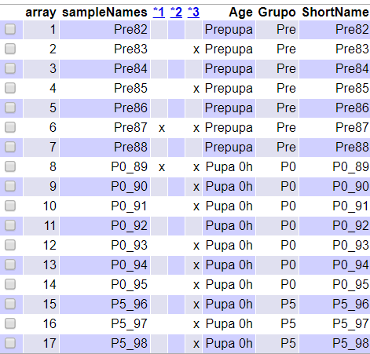
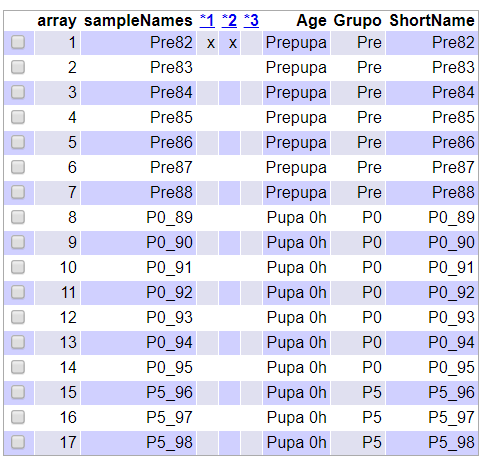
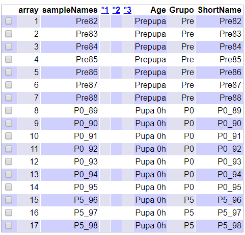
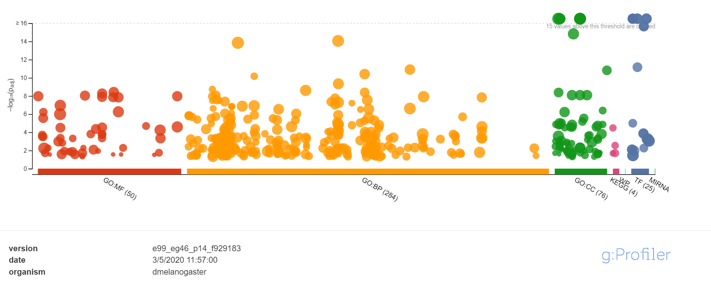
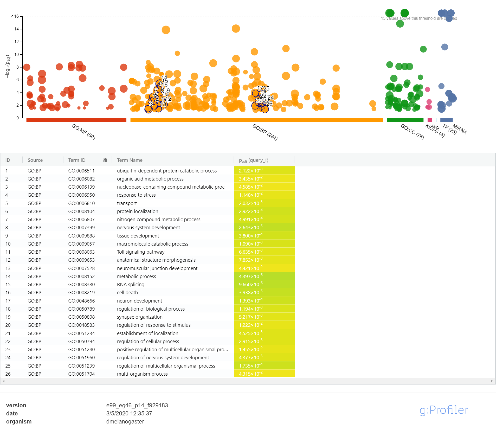

<font size="6">
**Enlace al GitHub:**https://github.com/LorenaGaMo/Gallardo_ADO_PEC1.git
</font>

\newpage
```{r setup, include=FALSE}
library(knitr)
knitr::opts_chunk$set(echo = TRUE, message = FALSE, warning = FALSE, 
                      comment = NA, prompt = TRUE, tidy = FALSE, 
                      fig.width = 7, fig.height = 7, fig_caption = TRUE,
                      cache=FALSE)
```

# ABSTRACT

Este trabajo se basa en el artículo publicado por @Hoopfer , donde se estudian los mecanismos celulares de la poda de axones en *Drosophila* (MB) durante la metamorfosis. Concretamente se utilizan 18 muestras del díptero divididas en tres gropos: en fase prepupa, recién pupado y a las 5 horas de haberlo hecho. Se compara los diferentes niveles de expresión de los genes después de normalizar y filtrar los datos.

# OBJETIVOS

El objetivo del estudio es estudiar las diferencias de expresión génica de la poda de axones dependiendo del estado de desarrollo en que se encuentra el díptero.

El objetivo de este trabajo es poner en práctica los conocimientos adquiridos para realizar un análisis de datos de microarray.
Se trata de un estudio de un factor con tres niveles diferentes (prepupa, pupa, pupa de 5 horas) y el objetivo es seleccionar los genes que se estén expresando de manera diferencial según la edad del individuo. 


# MATERIAL Y MÉTODOS

## Software y naturaleza de los datos

El software utilizado para realizar este estudio es el siguiente: R ^[https://cran.r-project.org/index.html] (versión 3.6.3) con el interfaz RStudio ^[https://www.rstudio.com/] y los paquetes de Bioconductor Affy ^[https://www.bioconductor.org/] (versión 3.10). El paquete de R ('limma()') para el ajuste del modelo lineal y la selección de genes. Para el * Gene Enrichment Analysis* se ha utilizado la aplicación g:Profiler ^[ https://biit.cs.ut.ee/gprofiler/gost], debido a que con el paquete *ReactomePA* de R he tenido diversos problemas.

Este trabajo se basa en el artículo de @Hoopfer y los datos públicos extraidos de de la base de datos Gene Expression Omnibus con su correspondiente códiga GSE10012. ^[https://www.ncbi.nlm.nih.gov/geo/geo2r/?acc=GSE10012]

## Preparación de los datos

Antes de empezar con el analisi propiamente se debe preparar el entorno de trabajo con un sistema de archivos.el hecho de tener la información bien estructurada facilita el proceso del analisis. Es recomendable tener instaladas las librerias necesarias ya que el proceso puede ser largo.

```{r, eval=FALSE}
setwd(".")
dir.create("data")
dir.create("results")
dir.create("figuras")
```
```{r, include=FALSE}
library(ggplot2)
library(ggrepel)
library(oligo)
library(Biobase)
library(GEOquery)
library(arrayQualityMetrics)
library(pvca)
library(genefilter)
library(limma)
library(gplots)
library(ReactomePA)
library(BiocGenerics)
library(BiocParallel)
library(BiocManager)
library(tinytex)
library(genefilter)
```

## Lectura datos crudos

Se debe preparar un fixero *targets.csv* de manera manual con la información obtenida en la base de datos (Table 1).

```{r, out.width= '75%', fig.align='center'}
targets <- read.csv2("./data/targets.csv", header = TRUE, sep = ",") 
knitr::kable(
  targets, booktabs = TRUE,
  caption = 'Contenido del fichero *targets.csv* ')
```


Para leer los ficheros *.CEL* propiamente se crea un nuevo data frame *rawData*, donde previamente de debe crar un nuevo objeto *my.targets* associado a los archivos *.CEL*.

```{r, include=FALSE}
celFiles <- list.celfiles("./data", full.names = TRUE)

my.targets <-read.AnnotatedDataFrame(file.path("./data","targets.csv"), 
                                      header = TRUE, row.names = 1, 
                                      sep=",") 
rawData <- read.celfiles(celFiles, phenoData = my.targets)

my.targets@data$ShortName->rownames(pData(rawData))

colnames(rawData)<-rownames(pData(rawData))

head(rawData)

```

## Control de calidad y exploración de los datos

Se realiza un control de calidad de los datos con el paquete 'arrayQualityMetrics()' el cual realiza diferentes test. 
El resumen del análisis de calidad lo encontramos dentro de la carpeta "resunts" en el fichero "index.htlm"(Figura 1). Las columnas 1, 2, y 3 nos indican los diferentes criterios de detección de *outlier* respectivamente: mediante distancias entre arrays, mediante boxplot y mediante MA plots.
Podemos observar que en las columnas 1 y 3 tenemos señaladas diversas muestras con una "X", esto nos indica que los posibles problemas a la ahora de normalizar los datos podrían derivarse de estas muestras ya que nos indica que esas muestras se pueden considerar que tienen  *outliers* en su distibución, en la categoria de la casilla donde estan señaladas. 


```{r, eval=F, message=FALSE}
arrayQualityMetrics(rawData, outdir = file.path("./results","rawData_quality"), force = T)
```
```{r control calidad, fig.align='center', out.width= '50%', fig.cap= "Fig.1 Tabla resumen de la calidad de los datos del fichero index.htlm" }


```

El control de calidad de los datos crudos también se puede realizar con un análisis gráfico. Para este trabajo se han realizado un boxplot (Fig.2), un cluster (Fig.3) y un análisis de componentes principales (Fig.4).En el caso del análisis de las componentes principales se ha utilizado la función definida por @Gonzalo y especificada en el apendice adjunto.

```{r control de calidad boxplot,echo=FALSE, fig.align='center', out.width= '75%',fig.cap= "Boxplot de los datos crudos"}

labels <- c("Pre","P0","P5")

boxplot(rawData, cex.axis = 0.5, las=2, which="all", main="Boxplot de valores de intensidad",
        col = c(rep("blue", 7), rep("purple", 7), rep("green", 3)))
legend("topleft", labels,fill= c("blue","purple","green"), bty="n")
```

En el boxplot podemos observar que la intensidad de las muestras es algo irregular tanto en el tamaño de las cajas como en su media. Tendremos que ver si al normalizar los datos se mejora esta variabilidad.

```{r control de calidad cluster, echo=FALSE, fig.align='center', fig.cap= " Cluster de los datos crudos",out.width= '75%' }
plot(hclust(dist(t(exprs(rawData)))))
```

Con el cluster de los datos crudos podemos observar que no existe una jerarquía entre los diferentes grupos, todas las muestras están mezcladas. Como pasa con el boxplot miraremos de mejóralo con la normalización de los datos.

```{r función PCA, include=FALSE}
plotPCA <- function(datos, labels, factor, scale, 
                    colores, size = 1.5, glineas = 0.25) {
  data <- prcomp(t(datos), scale = scale)
  #plot adjustments
  dataDF <- data.frame(data$x)
  Group <- factor
  loads <- round(data$sdev^2/sum(data$sdev^2)*100, 1)
  #main plot
  p1 <- ggplot(dataDF, aes(x=PC1, y =PC2)) +
    theme_classic() +
    geom_hline(yintercept = 0, color = "gray70") +
    geom_vline(xintercept = 0, color = "gray70") +
    geom_point(aes(color = Group), alpha = 0.55, size = 3) +
    coord_cartesian(xlim = c(min(data$x[,1])-5, max(data$x[,1])+5)) +
    scale_fill_discrete(name = "Group")
  #avoiding labels superposition
  p1 + geom_text_repel(aes(y = PC2 + 0.25, label = labels), segment.size = 0.25, size = size) +
    labs(x = c(paste("PC1", loads[1], "%")), y = c(paste("PC2", loads[2], "%"))) +
    theme(plot.title = element_text(hjust = 0.5)) +
    scale_colour_manual(values = colores)
}
```

```{r control de calidad, echo= FALSE, fig.align='center', fig.cap= " Anàlisis PCA de los datos crudos",out.width= '75%'}

plotPCA(exprs(rawData), labels = targets$ShortName, factor = targets$Grupo,
        scale = F, size = 3, colores = c("blue","purple","green"))
```

En el gráfico de las componentes principales vemos que la primera componente se explica el 46.6% de la variabilidad y el 20.9% con la segunda componente. Pero no se observan grupos definidos i diferencias entre las muestras.

## Normalización

Con el paso de normalización de los datos pretendemos mejorar los análisis anteriores con el objetivo de poder comparar las diferentes muestras entre sí y eliminar la variabilidad, debida a los efectos de la técnica o el análisis y no a la producida por las diferencias biológicas, con la transformación de los datos.
Se ha utilizado un método de normalización RMA, uno de los métodos más utilizados en la normalización de datos procedentes de array de Affymetrix, descrito por @Irizarry.
Para la realización de esta se ha creado un nuevo objeto con la función ‘rma()’.


```{r, echo=FALSE}
eset_rma<- rma(rawData)
eset_rma
write.csv2(exprs(eset_rma), file = "./results/datos_norm.csv")

```

## Control de calidad y exploración datos normalizados

Se vuelve a realizar un control de calidad de los datos pero esta vez ya transformados. En los nevos resultados se puede observar una mejora considerable de los datos, la unica muestra que presenta problemas es la Pre82 cn dos *outliers*.

```{r control datos normalizados, eval=FALSE}
arrayQualityMetrics(eset_rma, outdir = file.path("./results", "rawDataNorm_quality"), force = T)
```
```{r control calidad datos normalizados tabla, fig.align='center', fig.cap="Tabla resumen análisa datos normalizazados",out.width= '50%'}

```
```{r control calidad datos normalizados boxplot, fig.align='center', echo=FALSE,out.width= '75%'}
labels <- c("Pre","P0","P5")

boxplot(eset_rma, cex.axis = 0.5, las=2, which="all", main="Boxplot de valores de intensidad datos normalizados",
        col = c(rep("blue", 7), rep("purple", 7), rep("green", 3)))
legend("topleft", labels,fill= c("blue","purple","green"), bty="n")


```

El boxplot corrobora lo que hemos visto con el análisis anterior. La intensidad de las muestras es mucho más regular tanto en el tamaño de las cajas como en su media, aunque se pueden apreciar pequeñas diferencias.

```{r control calidad datos normalizados cluster, echo=FALSE, fig.align='center', fig.cap="Cluster datos normalizados",out.width= '75%'}
plot(hclust(dist(t(exprs(eset_rma)))))
```

Esta vez sí que podemos observar una jerarquía definida en el clúster de los datos normalizados. Se diferencian claramente las prepupas de las pupas y dentro del estas últimas se observa que las pupas de cero horas también de diferencian de las de 5 h.

```{r control calidad datos PCA, echo=FALSE, fig.align='center', fig.cap= " Anàlisis PCA de los datos normalizadoss", out.width= '75%'}
plotPCA(exprs(eset_rma), labels = targets$ShortName, factor = targets$Grupo,
        scale = F, size = 3, colores = c("blue","purple","green"))
```

En análisis de componentes principales de los datos normalizados volvemos a ver los tres grupos definidos y diferenciados como lo podíamos ver en el clúster. Esta vez la variabilidad entre ellos esta explicada en un 50.2% por la primera componente y en un 10.1% por la segunda.

## Selección de genes

Para ver qué porcentaje de genes presentan una variabilidad superior a la variabilidad intrínseca entre muestras, ya que estos serían los genes que están expresados diferencialmente. Esto se puede observar gráficamente con la representación de la desviación estándar de todos los genes. 
Se puede apreciar que hay un gran número de genes que se están expresando diferencialmente, aunque no llega a ser el 5% de los genes.
Los genes que se consideran con más variabilidad son aquellos con una desviación estándar por encima de los percentiles 90% y 95% , representados en el grafico por las líneas verticales.


```{r seleccion genes, fig.cap=" Distrubución de la variabilidad genica", echo= F, out.width= '75%', fig.align='center'}
sds <- apply(exprs(eset_rma), 1, sd)
sds0 <- sort(sds)
plot(1:length(sds0), sds0, xlab="Genes desde el menos al más variable", ylab="Desviación estándar")
abline(v=length(sds)*c(0.9,0.95))

```

## Anotaciones

Las anotaciones son el paso previo al filtraje de los datos normalizados para poder eliminar los genes sin identificador asociado. Para esto se debe cargar la librería *drosgenome1.db* para este estudio ( cada estudio tiene su paquete de anotaciones asociado) y así anidar el identificador del gen con la sonda.

```{r}

library(drosgenome1.db)
annotation(eset_rma)<-"drosgenome1.db"

```
## Filtraje de genes

Una vez tenemos las anotaciones correspondientes realizadas se procede al filtraje de los genes con poca variabilidad o variabilidad aleatoria. Este filtraje se puede realizar con el paquete *genefiltre* con la función *nsfilter()*.
Con este filtraje hemos conseguido eliminar 1023 genes.


```{r, echo=FALSE}


filtered <- nsFilter(eset_rma,require.entrez = TRUE, remove.dupEntrez = TRUE,
                     var.filter = TRUE, var.func = IQR, var.cutoff = 0.75,
                     filterByQuantile = T, feature.exclude = "^AFFX")

print(filtered$filter.log)
eset_filt<- filtered$eset
write.csv2(exprs(eset_filt), file="./results/Norm_data_filt.csv")

```

## Control de calidad datos filtrados

Una vez filtrados los datos normalizados se vuelve a realizar un control de calidad de los datos como en las veces anteriores. 
Esta vez podemos comprobar que se ha vuelto a mejorar el resultado y la muestra que presentaba problemas de *outliers* ya no los presenta.

Gráficamente el boxplot no presenta ninguna variación apreciable al anterior boxplot de datos normalizados. En el clúster podemos ver una reorganización interna de los grupos pero estos se mantienes igual de diferenciados entre sí.
En el PCA los tres grupos de diferencian aún más y se crea un subgrupo en las muestras de prepupa. El porcentaje de la variabilidad explicada por la primera componente vuelve a augmentar (66%) y la de la segunda a disminuir(8.3%).


```{r control calidad datos filtrados, eval= F}
arrayQualityMetrics(eset_filt, outdir = file.path("./results", "Norm_data_filt"), force= T)
```
```{r resultados control de calidad datos filtrdos, fig.align='center', fig.cap= "Resumen de la calidad de los datos filtrados",out.width= '50%' }

```
```{r boxplot control calidad datos filtrados, fig.align='center', echo= F,out.width= '75%' }
labels <- c("Pre","P0","P5")

boxplot(eset_filt, cex.axis = 0.5, las=2, which="all", main="Boxplot de valores de intensidad datos filtrados",
        col = c(rep("blue", 7), rep("purple", 7), rep("green", 3)))
legend("topleft", labels,fill= c("blue","purple","green","yellow"), bty="n")
```
```{r cluster control calidad datos filtrados, fig.align='center', fig.cap=" Cluster datos filtrados", echo=FALSE,out.width= '75%'}
plot(hclust(dist(t(exprs(eset_filt)))))
```
```{r control calidad datos filtrados PCA, echo=FALSE,out.width= '75%', fig.align='center', fig.cap= " Anàlisis PCA de los datos filtrados" }
plotPCA(exprs(eset_filt), labels = targets$ShortName, factor = targets$Grupo,
        scale = F, size = 3, colores = c("blue","purple","green"))

```
## Diseño matriz experimental

El siguiente paso en el estudio es la creación o diseño de la matriz experimental que se realiza con la función *designMat()* .
La matriz resultante es una matriz de 1 y 0 donde el valor 1 quiere decir que esa muestra ( que las encontramos dispuestas en filas) corresponde a un determinado grupo ( dispuestos en las columnas).

```{r diseño matriz,echo=FALSE}
designMat<- model.matrix(~0+Grupo, pData(eset_filt))

colnames(designMat) <- c("P0","P5","Pre")
print(designMat)
```

A continuación seguimos con la matriz de contrstes para la comparación 2 a 2 de los grupos creados
```{r matriz de contrastes, echo=F}
cont.matrix<- makeContrasts(PP0= Pre-P0, PP5= Pre-P5, PP05=P0-P5, levels = designMat)
cont.matrix
```
## Selección de genes diferencialmente expresados y anotación

Una vez ya tenemos  definidas la matriz de diseño y la de contraste con  el paquete *limma*podemos proceder a la selección de genes expresados diferencialmente y a su anotación.

```{r selección de genes }
fit<-lmFit(eset_filt, designMat)
fit.main<-contrasts.fit(fit, cont.matrix)
fit.main<-eBayes(fit.main)
head(fit.main)
results <- decideTests(fit.main)
summary(results)
```
```{r anotación de genes}
topTab_PP0 <- topTable(fit.main, number = nrow(fit.main),coef= 1, adjust="fdr")

topTab_PP5 <- topTable(fit.main, number = nrow(fit.main),coef= 2, adjust="fdr")

topTab_PP05 <- topTable(fit.main, number = nrow(fit.main), coef= 3, adjust="fdr")

head(topTab_PP0)
head(topTab_PP5)
head(topTab_PP05)
```
```{r listado de genes, echo= F}
annotatedTopTable <- function(topTab, anotPackage)
{
  topTab <- cbind(PROBEID=rownames(topTab), topTab)
  myProbes <- rownames(topTab)
  thePackage <- eval(parse(text = anotPackage))
  geneAnots <- select(thePackage, myProbes, c("SYMBOL", "ENTREZID", "GENENAME"))
  annotatedTopTab <- merge(x=geneAnots, y=topTab, by.x="PROBEID", by.y="PROBEID")
  return(annotatedTopTab)
}

topAnnotated_PP0 <- annotatedTopTable(topTab_PP0,
                                            anotPackage = "drosgenome1.db")
topAnnotated_PP5 <- annotatedTopTable(topTab_PP5,
                                              anotPackage = "drosgenome1.db")
topAnnotated_P05 <- annotatedTopTable(topTab_PP05,
                                      anotPackage = "drosgenome1.db")
head(topAnnotated_PP0)
head(topAnnotated_P05)
head(topAnnotated_PP5)
```


```{r listado de genes ficheros, eval=FALSE, include=F}
write.csv(topAnnotated_PP0, file="./results/Annotated_PP0.csv")
write.csv(topAnnotated_PP5, file="./results/Annotated_PP5.csv")
write.csv(topAnnotated_P05, file="./results/Annotated_P05.csv")
```

# RESULTADOS Y DISCUSIÓN

## Visualización de la expresión diferencial

Una visualitzación de los resultados es posible con los graficos tipo volcan. Estos gráficos muestran los genes con p-valores muy altos y por tanto con probabilidades elevadas de expresarse diferencialmente. Los genes más alejados del centro del gráfico son los más significativos, esto es, los primeros de la lista de selección de genes. Esto es debido a que el efecto biológico se representa en el eje de abscisas, al representar los cambios de expresión en escala logarítmica. En el eje ordenadas se representa el efecto estadístico al representar el logaritmo negativo de los p-valores.  

```{r visualización}
geneSymbols <- select(drosgenome1.db, rownames(fit.main), c("SYMBOL"))
SYMBOLS <- geneSymbols$SYMBOL

```
```{r visualización volcano 1,fig.align="center",fig.cap="Genes expresados diferencialmente para  PP0",out.width= '75%'}

volcanoplot(fit.main, coef = 1, highlight = 4, names = SYMBOLS)
abline(v=c(-1,1))

```

```{r visualización volcano 2,fig.align="center",fig.cap="Genes expresados diferencialmente para  PP5",out.width= '75%'}
volcanoplot(fit.main, coef = 2, highlight = 4, names = SYMBOLS)
abline(v=c(-1,1))
```
```{r visualización volcano 3,fig.align="center",fig.cap="Genes expresados diferencialmente para  P05",out.width= '75%' }
volcanoplot(fit.main, coef = 3, highlight = 4, names = SYMBOLS)
abline(v=c(-1,1))
```
## Comparaciónes multiples y visualización

A continuación, se muestran el número de genes que se expresan diferencialmente para las tres comparaciones realizadas en forma de table y de manera gráfica con un diagrama de Venn.

```{r, include= F}
res <- decideTests(fit.main, method = "separate", adjust.method = "fdr", p.value = 0.1, lfc = 1)
sum.res.rows <- apply(abs(res),1,sum)
res.selected <- res[sum.res.rows!=0,]
print(summary(res))

```

En el diagrama de Venn podemos observar que 14 de los genes significativos son comunes en los tres grupos, de los 614 regulados "Down" y de los 451 regulados "up", pero no se puede saber si son genes regulados "up" o "down".

```{r diagrama de Venn, fig.align='center', fig.cap="Diagrama de Venn de los genes en común", echo= F,out.width= '75%'}
vennDiagram(res.selected[, 1:3], cex = 0.9)
```

Los heatmaps son otra forma de visualizar estas comparaciones . En este tipo de gráficos se utiliza una paleta de colores para diferenciar los niveles de expresión. 

```{r heatmap, echo= F, echo= F, fig.cap=" Genes expresados diferencialmente",out.width= '75%'}
probesInHeatmap <- rownames(res.selected)
HMdata <- exprs(eset_filt)[rownames(exprs(eset_filt)) %in% probesInHeatmap,]
geneSymbols <- select(drosgenome1.db, rownames(HMdata), c("SYMBOL"))
SYMBOLS <- geneSymbols$SYMBOL
rownames(HMdata) <- SYMBOLS
my_palette <- colorRampPalette(c("blue", "red"))(n =299)
write.csv2(HMdata, file=file.path("./results/heatmap.csv"))


heatmap.2(HMdata, Rowv = T, Colv = T,
          scale = "row", col = my_palette, sepcolor = "white",
          sepwidth = c(0.05,0.05), cexRow = 0.5, cexCol = 0.9,
          key = F, density.info = "histogram",
          tracecol = NULL, dendrogram = "both", srtCol = 30)
```

## Significación biológica

```{r significacion biológica, echo=FALSE}
listOfTables <- list(PP0 = topTab_PP0,
                     PP5 = topTab_PP5,
                     PP05 = topTab_PP05)
listOfSelected <- list()
for(i in 1:length(listOfTables)){
  topTab <- listOfTables[[i]]
  whichGenes <- topTab["adj.P.Val"]<0.15
  selectedIDs <- rownames(topTab)[whichGenes]
  EntrezIDs <- select(drosgenome1.db, selectedIDs, c("ENTREZID"))
  EntrezIDs <- EntrezIDs$ENTREZID
  listOfSelected[[i]] <- EntrezIDs
  names(listOfSelected)[i] <- names(listOfTables)[i]
}
sapply(listOfSelected, length)
```
```{r significación biológica tablas, echo=FALSE}


library(org.Hs.eg.db)
mapped_genes2GO <- mappedkeys(org.Hs.egGO)
mapped_genes2KEGG <- mappedkeys(org.Hs.egPATH)
mapped_genes <- union(mapped_genes2GO, mapped_genes2KEGG)
```

```{r Enrich anàlisis, eval=FALSE, message=F}

listOfData <- listOfSelected[1:3]
comparisonsNames <- names(listOfData)
universe <- mapped_genes
for (i in 1:length(listOfData)) {
  genesIn <- listOfData[[i]]
  comparison <- comparisonsNames[i]
  enrich.result <- enrichPathway(gene = genesIn,
                                 pvalueCutoff = 0.05,
                                 readable = T,
                                 pAdjustMethod = "BH",
                                 organism = "fly",
                                 universe = universe)

 }
print(genesIn)
print(genesIn[1001:2310])
print(genesIn[2001:2310])
str(genesIn)
#write.csv2(as.data.frame(enrich.result), file.path("./results/enrich_results.cvs"))
#comparison<- comparisonsNames[1]
#cnetplot(enrich.result, categorySize="geneNum", showCategory = 3,vertex.label.cex = 0.2)

```

Debido a errores en la función de "Gene Enrichment Analysis" se ha realizado el estudio de significación biologica con la herremienta g:Profiler y estos han sido los resultados:

La herramienta que se ha utilizado es g: GOSt que realiza análisis de enriquecimiento estadístico para encontrar una significación biológica.
El primer resultado visible en g: GOSt es un diagrama interactivo de Manhattan que ilustra los resultados del análisis de enriquecimiento. El eje x representa términos funcionales que están agrupados y codificados por colores por fuentes de datos (la función molecular de GO es roja; los componentes celulares GO en de color verde, los procesos celulares Go en color naranja; rutas biológicas en rosa; motivos reguladores de DNA en azul y las fuentes que no se incluyeron en el análisis se muestran en gris). El eje y muestra los valores p de enriquecimiento ajustados en la escala negativa log10. 
Estadísticamente, los valores p más pequeños que 10 ^ -16 son altamente significativos y son los que tiene en cuenta la herramienta. De nuestra lista se han obviado 15 términos.
Podemos observar que los términos más abundantes(mayor número de genes) se encuentran en la sección de procesos celulares donde si nos fijamos hay dos zonas donde los términos son muy cercanos lo que significa que pertenecen a la misma subrama y que son estadísticamente significativos ( destacados con círculos negros y detallados en la lista subyacente).


```{r, echo= F, out.width= '75%' }


```
```{r ,echo= F, out.width= '75%' }

```


## Resumen de resultados
```{r}
Result_Files <- dir("./results/") 
knitr::kable(
  Result_Files, booktabs = TRUE,
  caption = "Listado de ficheros de resultados",
  col.names="Ficheros"
)
```


# APENDICE

```{r, eval=FALSE}
library(knitr)
knitr::opts_chunk$set(echo = TRUE, message = FALSE, warning = FALSE, 
                      comment = NA, prompt = TRUE, tidy = FALSE, 
                      fig.width = 7, fig.height = 7, fig_caption = TRUE,
                      cache=FALSE)

setwd(".")
dir.create("data")
dir.create("results")
dir.create("figuras")

library(ggplot2)
library(ggrepel)
library(oligo)
library(Biobase)
library(GEOquery)
library(arrayQualityMetrics)
library(pvca)
library(genefilter)
library(limma)
library(gplots)
library(ReactomePA)
library(BiocGenerics)
library(BiocParallel)
library(BiocManager)
library(tinytex)
library(genefilter)

targets <- read.csv2("./data/targets.csv", header = TRUE, sep = ",") 
knitr::kable(
  targets, booktabs = TRUE,
  caption = 'Contenido del fichero *targets.csv* ')
celFiles <- list.celfiles("./data", full.names = TRUE)

my.targets <-read.AnnotatedDataFrame(file.path("./data","targets.csv"), 
                                      header = TRUE, row.names = 1, 
                                      sep=",") 
rawData <- read.celfiles(celFiles, phenoData = my.targets)

my.targets@data$ShortName->rownames(pData(rawData))

colnames(rawData)<-rownames(pData(rawData))

head(rawData)

arrayQualityMetrics(rawData, outdir = file.path("./results","rawData_quality"), force = T)

labels <- c("Pre","P0","P5")

boxplot(rawData, cex.axis = 0.5, las=2, which="all", main="Boxplot de valores de intensidad",
        col = c(rep("blue", 7), rep("purple", 7), rep("green", 3)))
legend("topleft", labels,fill= c("blue","purple","green"), bty="n")
plot(hclust(dist(t(exprs(rawData)))))
plotPCA <- function(datos, labels, factor, scale, 
                    colores, size = 1.5, glineas = 0.25) {
  data <- prcomp(t(datos), scale = scale)
  #plot adjustments
  dataDF <- data.frame(data$x)
  Group <- factor
  loads <- round(data$sdev^2/sum(data$sdev^2)*100, 1)
  #main plot
  p1 <- ggplot(dataDF, aes(x=PC1, y =PC2)) +
    theme_classic() +
    geom_hline(yintercept = 0, color = "gray70") +
    geom_vline(xintercept = 0, color = "gray70") +
    geom_point(aes(color = Group), alpha = 0.55, size = 3) +
    coord_cartesian(xlim = c(min(data$x[,1])-5, max(data$x[,1])+5)) +
    scale_fill_discrete(name = "Group")
  #avoiding labels superposition
  p1 + geom_text_repel(aes(y = PC2 + 0.25, label = labels), segment.size = 0.25, size = size) +
    labs(x = c(paste("PC1", loads[1], "%")), y = c(paste("PC2", loads[2], "%"))) +
    theme(plot.title = element_text(hjust = 0.5)) +
    scale_colour_manual(values = colores)
}
plotPCA(exprs(rawData), labels = targets$ShortName, factor = targets$Grupo,
        scale = F, size = 3, colores = c("blue","purple","green"))
eset_rma<- rma(rawData)
eset_rma
write.csv2(exprs(eset_rma), file = "./results/datos_norm.csv")
arrayQualityMetrics(eset_rma, outdir = file.path("./results", "rawDataNorm_quality"), force = T)


labels <- c("Pre","P0","P5")

boxplot(eset_rma, cex.axis = 0.5, las=2, which="all", main="Boxplot de valores de intensidad datos normalizados",
        col = c(rep("blue", 7), rep("purple", 7), rep("green", 3)))
legend("topleft", labels,fill= c("blue","purple","green"), bty="n")


plot(hclust(dist(t(exprs(eset_rma)))))


plotPCA(exprs(eset_rma), labels = targets$ShortName, factor = targets$Grupo,
        scale = F, size = 3, colores = c("blue","purple","green"))


## Selección de genes

sds <- apply(exprs(eset_rma), 1, sd)
sds0 <- sort(sds)
plot(1:length(sds0), sds0, xlab="Genes desde el menos al más variable", ylab="Desviación estándar")
abline(v=length(sds)*c(0.9,0.95))


## Anotaciones


library(drosgenome1.db)
annotation(eset_rma)<-"drosgenome1.db"


## Filtraje de genes


filtered <- nsFilter(eset_rma,require.entrez = TRUE, remove.dupEntrez = TRUE,
                     var.filter = TRUE, var.func = IQR, var.cutoff = 0.75,
                     filterByQuantile = T, feature.exclude = "^AFFX")

print(filtered$filter.log)
eset_filt<- filtered$eset
write.csv2(exprs(eset_filt), file="./results/Norm_data_filt.csv")


## Control de calidad dato filtrados

arrayQualityMetrics(eset_filt, outdir = file.path("./results", "Norm_data_filt"), force= T)


labels <- c("Pre","P0","P5")

boxplot(eset_filt, cex.axis = 0.5, las=2, which="all", main="Boxplot de valores de intensidad datos filtrados",
        col = c(rep("blue", 7), rep("purple", 7), rep("green", 3)))
legend("topleft", labels,fill= c("blue","purple","green","yellow"), bty="n")

plot(hclust(dist(t(exprs(eset_filt)))))

plotPCA(exprs(eset_filt), labels = targets$ShortName, factor = targets$Grupo,
        scale = F, size = 3, colores = c("blue","purple","green"))

## Diseño matriz experimental

designMat<- model.matrix(~0+Grupo, pData(eset_filt))

colnames(designMat) <- c("P0","P5","Pre")
print(designMat)

cont.matrix<- makeContrasts(PP0= Pre-P0, PP5= Pre-P5, PP05=P0-P5, levels = designMat)
cont.matrix

## Selección de genes diferencialmente expresados y anotación

fit<-lmFit(eset_filt, designMat)
fit.main<-contrasts.fit(fit, cont.matrix)
fit.main<-eBayes(fit.main)
head(fit.main)
results <- decideTests(fit.main)
summary(results)

topTab_PP0 <- topTable(fit.main, number = nrow(fit.main),coef= 1, adjust="fdr")

topTab_PP5 <- topTable(fit.main, number = nrow(fit.main),coef= 2, adjust="fdr")

topTab_PP05 <- topTable(fit.main, number = nrow(fit.main), coef= 3, adjust="fdr")

head(topTab_PP0)
head(topTab_PP5)
head(topTab_PP05)

annotatedTopTable <- function(topTab, anotPackage)
{
  topTab <- cbind(PROBEID=rownames(topTab), topTab)
  myProbes <- rownames(topTab)
  thePackage <- eval(parse(text = anotPackage))
  geneAnots <- select(thePackage, myProbes, c("SYMBOL", "ENTREZID", "GENENAME"))
  annotatedTopTab <- merge(x=geneAnots, y=topTab, by.x="PROBEID", by.y="PROBEID")
  return(annotatedTopTab)
}

topAnnotated_PP0 <- annotatedTopTable(topTab_PP0,
                                            anotPackage = "drosgenome1.db")
topAnnotated_PP5 <- annotatedTopTable(topTab_PP5,
                                              anotPackage = "drosgenome1.db")
topAnnotated_P05 <- annotatedTopTable(topTab_PP05,
                                      anotPackage = "drosgenome1.db")
head(topAnnotated_PP0)
head(topAnnotated_P05)
head(topAnnotated_PP5)

write.csv(topAnnotated_PP0, file="./results/Annotated_PP0.csv")
write.csv(topAnnotated_PP5, file="./results/Annotated_PP5.csv")
write.csv(topAnnotated_P05, file="./results/Annotated_P05.csv")


# RESULTADOS

## Visualización de la expresión diferencial

geneSymbols <- select(drosgenome1.db, rownames(fit.main), c("SYMBOL"))
SYMBOLS <- geneSymbols$SYMBOL

volcanoplot(fit.main, coef = 1, highlight = 4, names = SYMBOLS)
abline(v=c(-1,1))


volcanoplot(fit.main, coef = 2, highlight = 4, names = SYMBOLS)
abline(v=c(-1,1))


volcanoplot(fit.main, coef = 3, highlight = 4, names = SYMBOLS)
abline(v=c(-1,1))

## Comparaciónes multiples y visualización


res <- decideTests(fit.main, method = "separate", adjust.method = "fdr", p.value = 0.1, lfc = 1)
sum.res.rows <- apply(abs(res),1,sum)
res.selected <- res[sum.res.rows!=0,]
print(summary(res))


vennDiagram(res.selected[, 1:3], cex = 0.9)

probesInHeatmap <- rownames(res.selected)
HMdata <- exprs(eset_filt)[rownames(exprs(eset_filt)) %in% probesInHeatmap,]
geneSymbols <- select(drosgenome1.db, rownames(HMdata), c("SYMBOL"))
SYMBOLS <- geneSymbols$SYMBOL
rownames(HMdata) <- SYMBOLS
my_palette <- colorRampPalette(c("blue", "red"))(n =299)
write.csv2(HMdata, file=file.path("./results/heatmap.csv"))


heatmap.2(HMdata, Rowv = T, Colv = T,
          scale = "row", col = my_palette, sepcolor = "white",
          sepwidth = c(0.05,0.05), cexRow = 0.5, cexCol = 0.9,
          key = F, density.info = "histogram",
          tracecol = NULL, dendrogram = "both", srtCol = 30)

## Significación biológica


listOfTables <- list(PP0 = topTab_PP0,
                     PP5 = topTab_PP5,
                     PP05 = topTab_PP05)
listOfSelected <- list()
for(i in 1:length(listOfTables)){
  topTab <- listOfTables[[i]]
  whichGenes <- topTab["adj.P.Val"]<0.15
  selectedIDs <- rownames(topTab)[whichGenes]
  EntrezIDs <- select(drosgenome1.db, selectedIDs, c("ENTREZID"))
  EntrezIDs <- EntrezIDs$ENTREZID
  listOfSelected[[i]] <- EntrezIDs
  names(listOfSelected)[i] <- names(listOfTables)[i]
}
sapply(listOfSelected, length)


library(org.Hs.eg.db)
mapped_genes2GO <- mappedkeys(org.Hs.egGO)
mapped_genes2KEGG <- mappedkeys(org.Hs.egPATH)
mapped_genes <- union(mapped_genes2GO, mapped_genes2KEGG)


```

# REFERENCIAS
